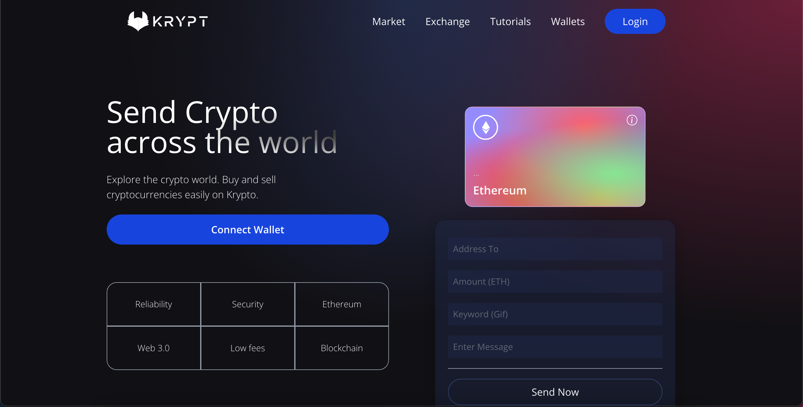

# Krypt

## _My first try of making a blockchain app_

Krypt is a presentation of me following a tutorial on [Youtube](https://www.youtube.com/watch?v=Wn_Kb3MR_cU) about blockchain appliactions. Krypt was made using React, Vite, and tailwind. The blockchain part was made using Hardhat and Alchemy.



## Features

- Send Ethereum across the blockchain
- See all your transactions with information regarding the sender, the reciever and what message and gif you included

## Installation

```sh
git clone https://github.com/nazirelpustaty/blockchain.git
cd blockchain/client
npm run dev
```

## License

MIT

**Free Software, Hell Yeah!**
